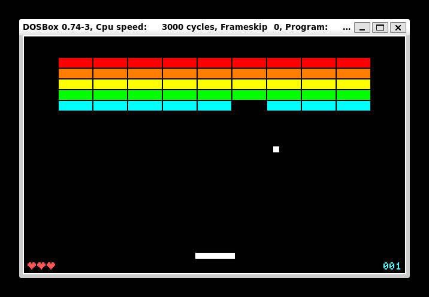

# RowBlocks

A Breakout/Arkanoid-style arcade game written in 16-bit x86 assembly for DOS. Single-file COM program targeting real-mode DOS with VGA Mode 13h graphics and PC speaker audio.

## Screenshot

<!-- Add screenshot here -->


## Gameplay

Move the paddle left and right to bounce the ball and destroy all the bricks on screen. Clear every brick to advance to the next level. You start with **3 lives** — lose them all and the game resets.

| Key | Action |
|-----|--------|
| `A` | Move paddle left |
| `D` | Move paddle right |
| `ESC` | Quit to DOS |

Any key also unpauses the game at the game-over screen.

## Features

- VGA Mode 13h — 320x200, 256-colour graphics
- Custom keyboard ISR (INT 09h) for responsive input
- V-Retrace sync to eliminate screen tearing
- PC speaker audio: distinct sounds for bounce, brick break, life lost, and level clear
- HUD with score and lives (hearts)
- Coloured brick rows
- Ball position clamping prevents out-of-bounds escape near walls
- Score capped at 255 to prevent overflow wrap

## Building

**Requirements:** [NASM](https://www.nasm.us/) and a DOS environment ([DOSBox](https://www.dosbox.com/), FreeDOS, or real hardware).

```bash
nasm -f bin game.asm -o game.com
```

### Run (DOSBox)

```
dosbox game.com
```

## Technical Overview

| Detail | Value |
|--------|-------|
| Assembler | NASM |
| Bit mode | 16-bit real mode |
| Binary format | DOS COM (`.com`) |
| Origin | `0x100` |
| Video mode | INT 10h Mode 13h (320x200, 256 colours) |
| VRAM segment | `0xA000` |

### Key Routines

| Routine | Description |
|---------|-------------|
| `KEYBOARD_ISR` | Custom INT 09h handler; tracks A, D, ESC key state |
| `CHECK_WALL_COLLISIONS` | Reflects ball off screen edges with position clamping |
| `CHECK_PADDLE_COLLISION` | Ball–paddle collision with steer-angle response |
| `CHECK_LEVEL_COLLISION` | Brick grid collision detection, scoring, and life loss |
| `DRAW_LEVEL` | Full scene render: background, bricks, paddle, ball, HUD |
| `SET_SPEAKER_FREQ` / `SPEAKER_ON` / `SPEAKER_OFF` | 8253 PIT and PC speaker control |
